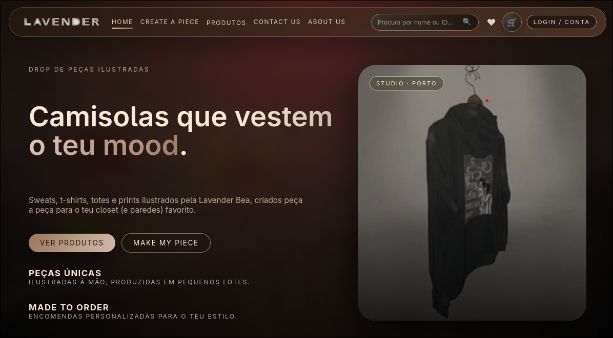

# Lavender Bea



## Sobre o Projeto

**Lavender Bea** é uma plataforma de e-commerce dedicada à venda de artesanato e peças personalizadas. O projeto oferece uma experiência completa de compra online, incluindo catálogo de produtos, carrinho de compras, favoritos e funcionalidades administrativas.

## Características

- 🛍️ **Catálogo de Produtos** - Browsing e filtragem de artigos artesanais
- ❤️ **Sistema de Favoritos** - Salve seus produtos preferidos
- 🛒 **Carrinho de Compras** - Gerencie seus itens antes de finalizar a compra
- 👤 **Conta de Usuário** - Crie e gerencie sua conta pessoal
- 🎨 **Criar Peças Personalizadas** - Encomende peças customizadas
- 🔐 **Painel Administrativo** - Gerenciamento de produtos e usuários
- 🔍 **Buscador** - Encontre produtos rapidamente

## Tecnologias Utilizadas

- **Backend**: PHP
- **Frontend**: HTML, CSS, JavaScript
- **Banco de Dados**: MySQL
- **Estilos**: CSS3 com suporte responsivo
- **Padrão**: MVC com repositórios

## Estrutura do Projeto

```
src/
├── php/               # Lógica de backend
│   ├── core/         # Configurações e funções principais
│   ├── pages/        # Páginas da aplicação
│   ├── actions/      # Ações e lógica de negócio
│   └── repositories/ # Camada de dados
├── css/              # Estilos da aplicação
├── js/               # Scripts do cliente
└── sql/              # Scripts do banco de dados
```

## Instalação

1. Clone o repositório
2. Configure as variáveis de ambiente (veja `src/php/core/config.php`)
3. Crie o banco de dados executando `src/sql/lavender_bea.sql`
4. Acesse a aplicação através do navegador

### Variáveis de Ambiente

```
LAVENDER_DB_HOST=localhost
LAVENDER_DB_PORT=3306
LAVENDER_DB_NAME=lavender_bea
LAVENDER_DB_USER=root
LAVENDER_DB_PASS=root
LAVENDER_STORAGE_PATH=/path/to/uploads
```

## Credenciais Padrão

- **Usuário Admin**: admin
- **Senha Admin**: edgarL123#

⚠️ **Nota**: Mude a senha do administrador em produção!

## Documentação

- Veja [modelo ER](./modelo_er/lavender_bea_er.drawio) para a estrutura do banco de dados
- Relatórios do projeto em [relatorios/](./relatorios/)

## Licença

Veja o arquivo [LICENSE](./LICENSE) para mais detalhes.
